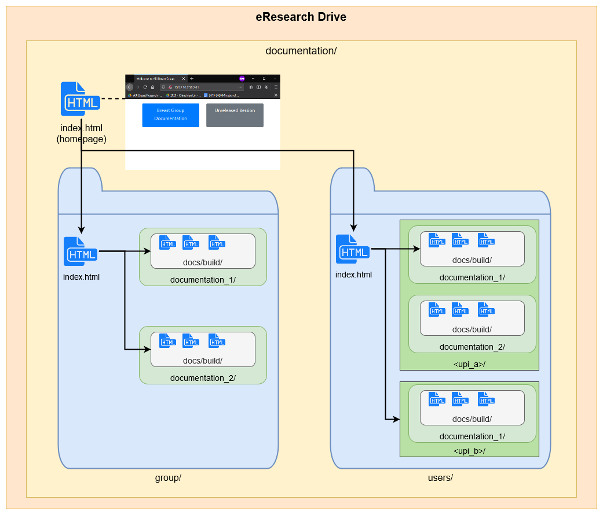

============
Introduction
============

Simple-doc-server is a tool to set up a `Nginx <https://www.nginx.com/>`_-based static website for hosting your individual and group's documentation.
All the documentation will be hosted on a Nginx-based web server running on your local machine or a remote virtual machine.

Architecture
============

Below is an example of how the folder structure of the simple doc server would look like if it is running on a mounted network drive (in this case, it is the university eResearch drive).

   Documentation server architecture

Contributors
============

* Chinchien Lin
* Thiranija Prasad Babarenda Gamage
